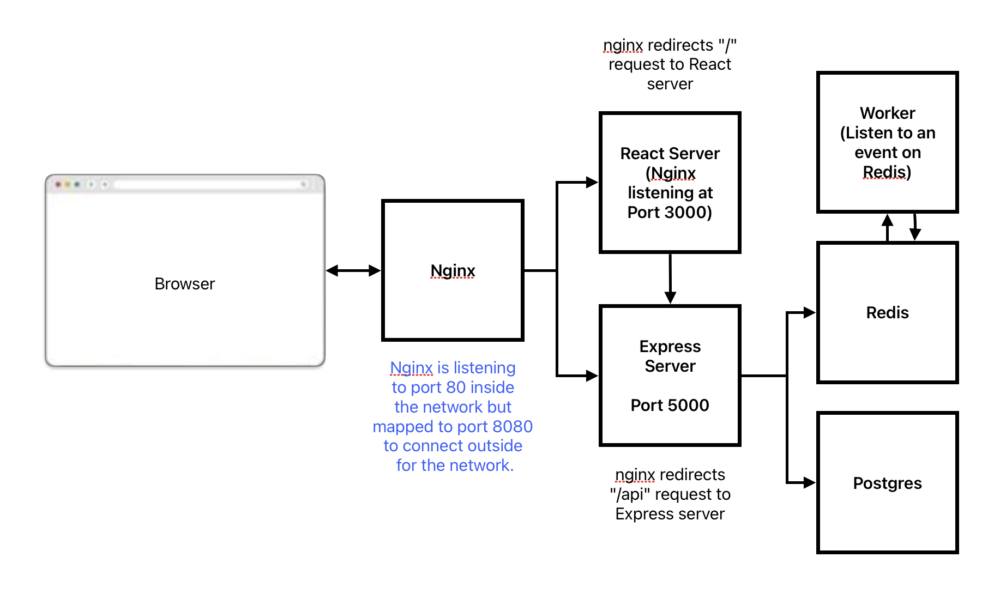

# 1). Running The Application.

### To run this application first install Docker desktop on you system.
## After that, nagivate to root folder of this project.
### For dev env, run the command: 
> docker compose up --build -f docker-compose.dev.yml'''
### For prod env, run the command: 
> docker compose up --build
### After running any one of above command, Navigate to http://localhost:8080

# 2). About the application.

### This is just a simple project done in a complex manner, to learn various concepts of Docker, this project compute _*nth*_ Fibonnaci Sequence element.
#### Various components of (Containers involved are):
#### a). React server: An web application made via user, where he can enter the index and get an input for the same.
#### b). Express Server: Backend api which are called by react server and which later persists data in postgres and triggers **_worker_** to update redis as well.
#### c). Worker: Subscribes to insert event, triggered by express server, and updates the value in redis server.
#### d). Redis  server: Stores all the indices and the calculated value as key - value pairs.
#### e). Postgres: This simply stores all the indices that were computed.

## The below diagram shows the architecture diagram:

